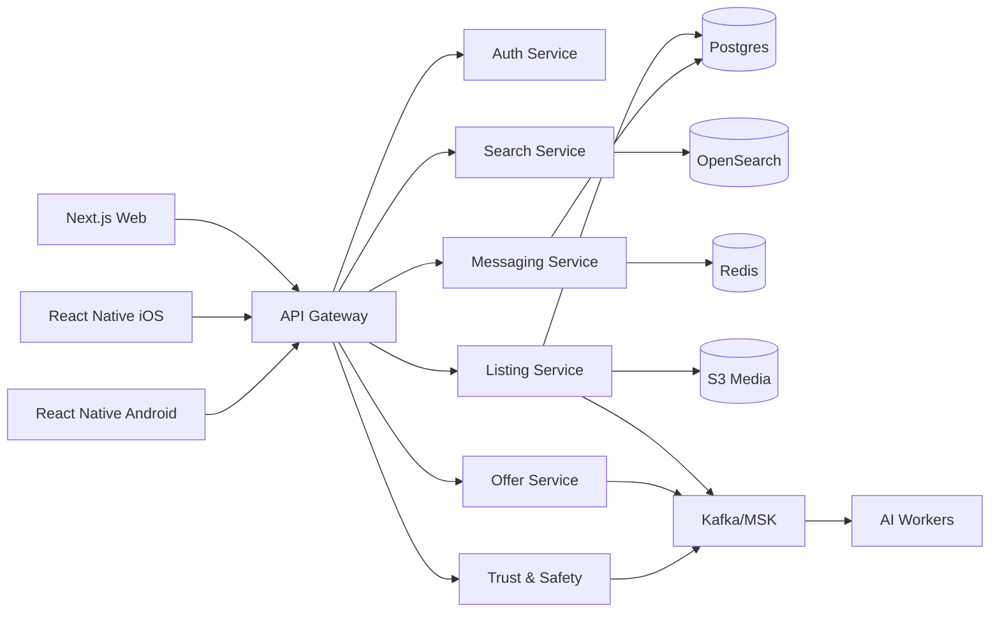

# Kerodex Architecture

## Zero-Cost First Step

Start with a modular monolith locally:

- Static responsive web app.
- Node API with REST endpoints.
- In-memory seed data.
- Server-sent events for live listing updates.
- No cloud bill.

This keeps the product moving while preserving boundaries for later extraction.

## Near-Free MVP

- Web: Next.js when dependencies are installed, deployed to Vercel or Cloudflare Pages free tier.
- API: NestJS or Fastify service on a free/low-cost host.
- Database: Neon or Supabase free Postgres.
- Search: Postgres full-text + trigram indexes before OpenSearch.
- Media: local uploads in dev, S3-compatible storage later.
- Realtime: WebSockets or Server-Sent Events; Redis only when needed.
- Maps: Mapbox free tier with strict token/domain limits.

## Scale Target

## Service Boundaries

- Auth: OAuth, JWT sessions, MFA, devices.
- Users: profiles, seller reputation, verification state.
- Listings: vehicle records, listing lifecycle, seller inventory.
- Search: indexing, filtering, ranking, geo queries.
- Messaging: conversations, read receipts, typing, attachments.
- Offers: offers, counters, expirations, audit trail.
- Payments: boosts, subscriptions, refunds, Stripe events.
- Trust: reports, fraud scoring, moderation workflows.
- Vehicle intelligence: VIN decode, recalls, market value, history providers.
- AI: descriptions, recommendations, pricing, image moderation, scam detection.

## AWS Cost Control

Use AWS later, not first. When moving there:

- Avoid EKS at MVP stage; it is powerful but not cheap.
- Prefer one small ECS/Fargate service or Lightsail initially.
- Use RDS only when revenue or reliability needs justify it.
- Add OpenSearch after Postgres search is no longer good enough.
- Put hard budgets and billing alerts in place before provisioning anything.
