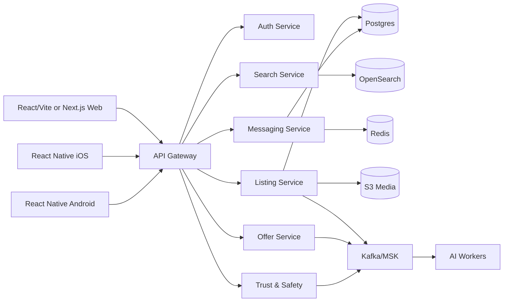

# Kerodex Architecture

## Current Local Architecture

Kerodex currently runs as a low-cost modular prototype:

- React/Vite/Tailwind web app in `apps/web-react`.
- Node API/static server in `apps/api`.
- The API serves `apps/web-react/dist` when a React build exists and falls back to the legacy static prototype in `apps/web/public`.
- REST endpoints for listings, conversations, demo auth, and VIN decode.
- JSON-backed local seed store behind the API, with a Postgres-ready adapter.
- Leaflet/CARTO client maps with price pins and listing popup cards.
- No required cloud bill for local development.

This keeps the product moving while preserving boundaries for later extraction.

## Near-Free MVP

- Web: keep the React app, then decide between Vite static hosting or Next.js if SSR becomes useful.
- API: current Node server can evolve into Fastify/NestJS once routing and middleware needs grow.
- Database: Neon, Supabase, or AWS RDS Postgres when hosting leaves local JSON.
- Search: Postgres full-text, trigram, and geo queries before OpenSearch.
- Media: local previews in dev, S3-compatible storage for real uploads.
- Realtime: WebSockets or Server-Sent Events; Redis only when needed.
- Maps: Leaflet/CARTO during beta; consider Google/Mapbox only if routing, geocoding, or usage needs justify keys/cost.

## Scale Target

## Service Boundaries

- Auth: OAuth, JWT sessions, MFA, devices.
- Users: profiles, seller reputation, verification state.
- Listings: vehicle records, listing lifecycle, seller inventory.
- Search: indexing, filtering, ranking, geo queries.
- Messaging: conversations, read receipts, typing, attachments.
- Offers: offers, counters, expirations, audit trail.
- Payments: boosts, subscriptions, refunds, Stripe events.
- Trust: reports, fraud scoring, moderation workflows.
- Vehicle intelligence: VIN decode, recalls, market value, history providers.
- AI: descriptions, recommendations, pricing, image moderation, scam detection.

## AWS Cost Control

Use AWS later, not first. When moving there:

- Avoid EKS at MVP stage; it is powerful but not cheap.
- Prefer one small ECS/Fargate service or Lightsail initially.
- Use RDS only when revenue or reliability needs justify it.
- Add OpenSearch after Postgres search is no longer good enough.
- Put hard budgets and billing alerts in place before provisioning anything.
